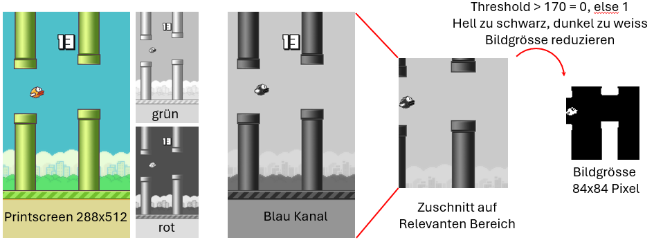

# Flappy Bird Reinforcement Learning Projekt
CAS advanced Machine Learning Herbst 2024
ModulReinforcement Learning

## Überblick
Dieses Projekt untersucht die Anwendung von Deep Q-Networks (DQN) zum Spielen von Flappy Bird, einem beliebten Handyspiel. Ziel war es, einen KI-Agenten zu trainieren, der das Spiel effektiv anhand von visuellem Input spielt, wobei die Entwicklung von einem einfachen zustandsbasierten Ansatz zu einem komplexeren bildbasierten Modell fortschritt.

## Projektstadien
1. Baseline DQN-Modell
Zunächst wurde ein einfaches DQN-Modell als Minimum Viable Product (MVP) implementiert:

    Input: 12 Zustandsvariablen (z.B. Position des Vogels, Röhrenstandorte)
    Architektur: Eine versteckte Schicht mit 1024 Neuronen
    Output: 2 Aktionen (flappen oder nicht flappen)

Dieser Ansatz diente als Baseline für den Vergleich mit fortgeschritteneren Methoden.
2. Bildbasiertes DQN-Modell
Das Projekt entwickelte sich weiter zur Verwendung von Rohbildern des Spiels als Input:

    Vorverarbeitung: Umwandlung von Screenshots in 84x84 Pixel große Schwarz-Weiß-Bilder
    Erster Versuch: Einzelbild-Input mit einem einfachen konvolutionellen neuronalen Netzwerk

3. Fortgeschrittenes bildbasiertes Modell
Zur Verbesserung der Leistung wurde das Modell erweitert:

    Input: Stapel von 4 aufeinanderfolgenden Frames (84x84x4)
    Architektur: 3 Konvolutionsschichten gefolgt von vollverbundenen Schichten
    Dieser Ansatz ermöglichte es dem Modell, Geschwindigkeit und Beschleunigung zu lernen

Technische Details
# Bildvorverarbeitung
Um das Bild als Input zu nutzen, wurde es wie folge vorverarbeitet:

## Finale Modellarchitektur

    self.conv1 = nn.Conv2d(in_channels=4, out_channels=32, kernel_size=8, stride=4)
    self.relu1 = nn.ReLU(inplace=True)
    self.conv2 = nn.Conv2d(32, 64, 4, 2)
    self.relu2 = nn.ReLU(inplace=True)
    self.conv3 = nn.Conv2d(64, 64, 3, 1)
    self.relu3 = nn.ReLU(inplace=True)
    self.fc4 = nn.Linear(3136, 1024)
    self.relu4 = nn.ReLU(inplace=True)
    self.fc5 = nn.Linear(1024, self.number_of_actions)  # actions = 2

## Ergebnisse und Beobachtungen

- Das anfängliche zustandsbasierte DQN lieferte eine funktionale Baseline.
- Das erste bildbasierte Modell mit Einzelbild-Input zeigte begrenzte Lernkapazität.
- Das finale Modell mit 4 gestapelten Frames und einer tieferen konvolutionellen Architektur zeigte signifikante Verbesserungen in der Spielleistung.

## Fazit
Dieses Projekt zeigt die Entwicklung von einem einfachen zustandsbasierten Reinforcement-Learning-Modell zu einem  bildbasierten Ansatz für das Spielen von Flappy Bird. Zielführend für gute Resultate war erst der Input von vier Bildern. So konnte die Spieldynamik (Geschwindigkeit und Beschleunigung) besser erfasst werden und hohe Scores erreicht werden.